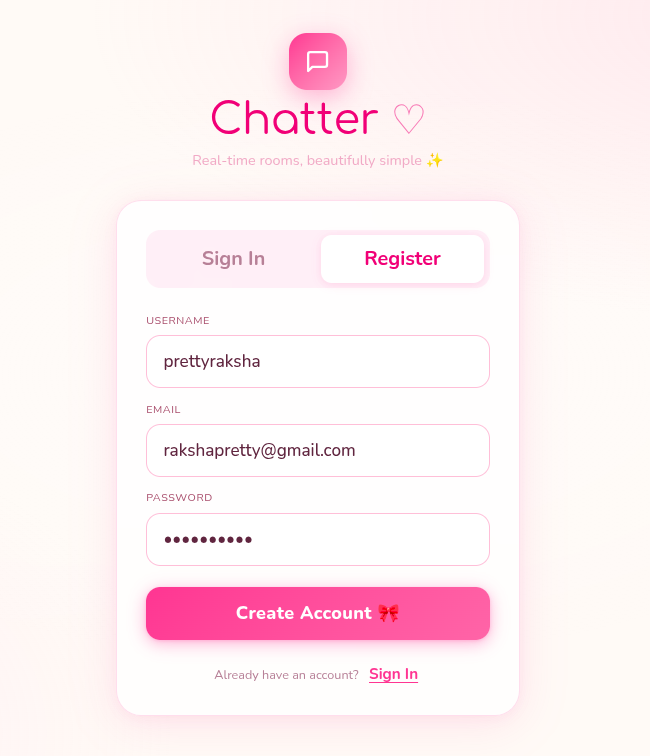
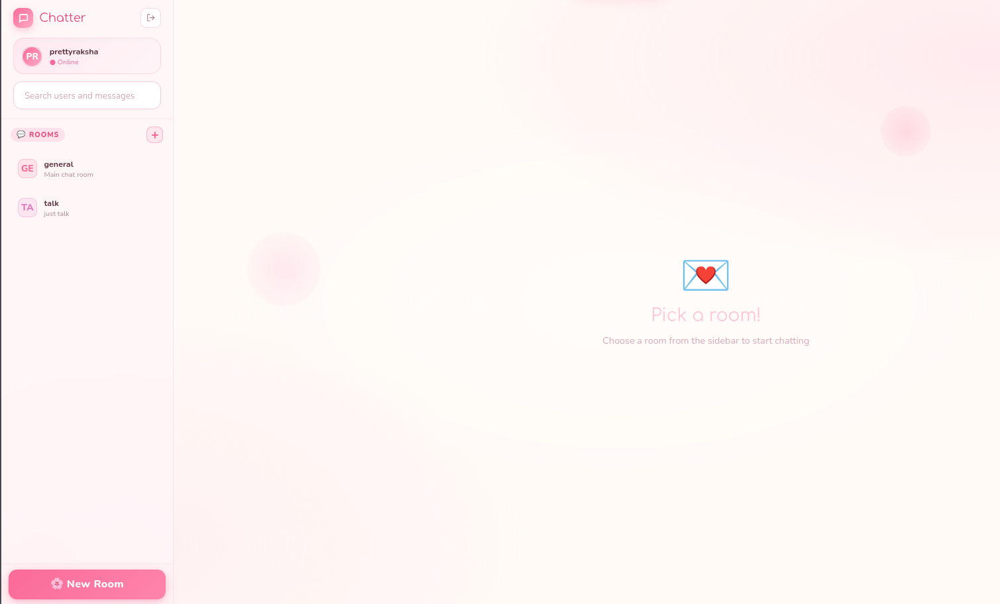
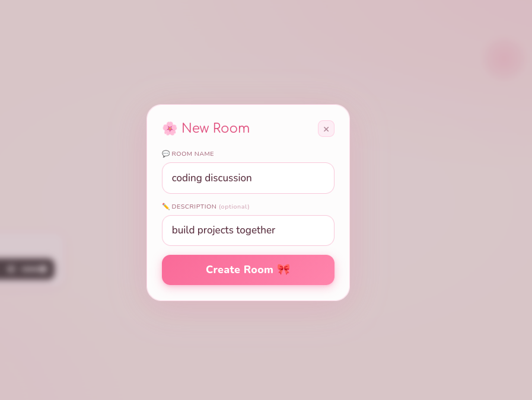
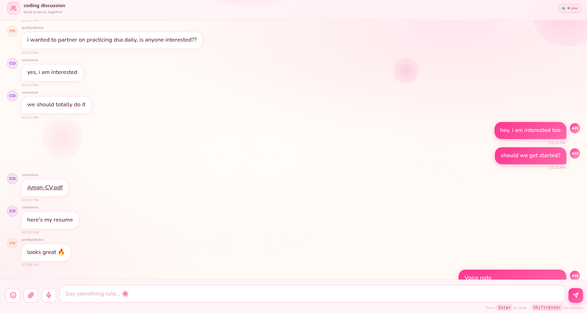
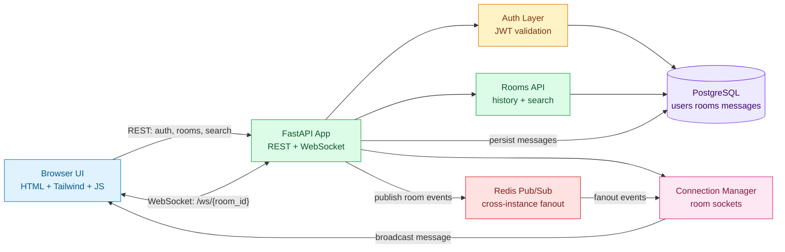
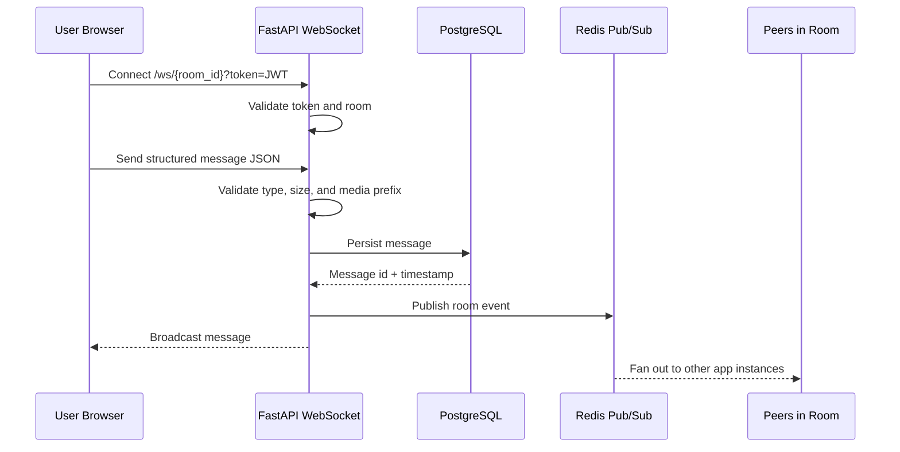
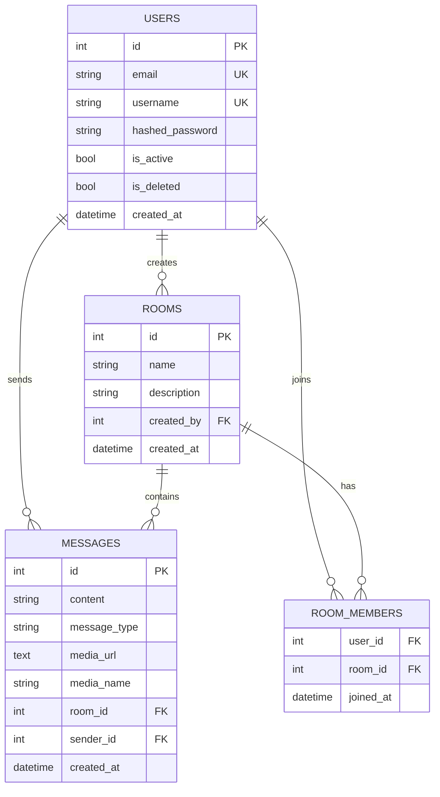

# Real-Time Chat App

<p align="center">
  <strong>A real-time room chat application with authentication, message history, media sharing, voice notes, global search, and emoji support.</strong>
</p>

<p align="center">
  
  
  
  
  
</p>

<p align="center">
  <a href="#features">Features</a> ·
  <a href="#architecture">Architecture</a> ·
  <a href="#system-design">System Design</a> ·
  <a href="#quick-start">Quick Start</a> ·
  <a href="#api-surface">API Surface</a>
</p>

---

## Features

- JWT-based register, login, and authenticated session handling.
- Realtime room messaging over WebSockets.
- Persistent message history loaded when users enter a room.
- Text, image, audio, video, file, and voice-note messages.
- Emoji picker in the composer.
- Global search for users and message content.
- Room creation and room list navigation.
- Redis pub/sub support for multi-worker message broadcast.
- PostgreSQL persistence with SQLAlchemy models and Alembic migrations.
- Static frontend served directly by FastAPI.

## UI Preview

### Register/Login
JWT Based Authentication!

---


### Home Page
Select a room to get started!

---


### New Room
Create your own messaging room!

---


### Group Chat
Connect to people and share your thoughts!

---



## Tech Stack

| Layer | Technology |
| --- | --- |
| Backend | FastAPI, Python 3.12 |
| Realtime | WebSockets, Redis pub/sub |
| Database | PostgreSQL |
| ORM | SQLAlchemy |
| Migrations | Alembic |
| Auth | JWT, OAuth2 password flow, passlib/bcrypt |
| Frontend | HTML, Tailwind CDN, vanilla JavaScript |
| Runtime | Uvicorn |
| Local infra | Docker, Docker Compose |


## Architecture



## System Design

### Message Delivery Flow



### Data Model



## API Surface

| Method | Path | Purpose |
| --- | --- | --- |
| `POST` | `/auth/register` | Create a user |
| `POST` | `/auth/login` | Get a JWT access token |
| `GET` | `/auth/me` | Get current user profile |
| `GET` | `/auth/users/search?q=` | Search users by username |
| `POST` | `/rooms` | Create a room |
| `GET` | `/rooms` | List rooms |
| `GET` | `/rooms/{room_id}/history` | Load room message history |
| `GET` | `/rooms/search/messages?q=` | Search messages |
| `WS` | `/ws/{room_id}?token=` | Realtime room messaging |

## Quick Start

Create a `.env` file:

```env
DATABASE_URL=postgresql://postgres:password@db/chatapi
REDIS_URL=redis://redis:6379/0
SECRET_KEY=replace-with-a-long-random-secret
ALGORITHM=HS256
PORT=8000
```

Run with Docker Compose:

```bash
docker compose up --build
```

Apply migrations:

```bash
docker compose exec api alembic upgrade head
```

Open the app:

```text
http://localhost:8000
```

## Local Development

Install dependencies with `uv`:

```bash
uv sync
```

Run migrations:

```bash
uv run alembic upgrade head
```

Start the API:

```bash
uv run uvicorn app.main:app --reload
```


## Realtime Message Shape

```json
{
  "message_type": "text",
  "content": "Hello team"
}
```

Media messages include a browser data URL:

```json
{
  "message_type": "image",
  "content": "Screenshot from today",
  "media_url": "data:image/png;base64,...",
  "media_name": "screenshot.png"
}
```

Supported `message_type` values:

- `text`
- `image`
- `audio`
- `video`
- `file`
